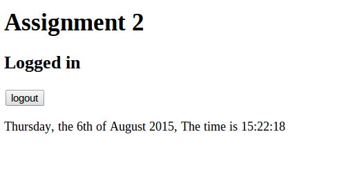

##Extra Testcases

##Test case 3.1, Login with "Keep me logged in" 
Normal navigation to page, page is shown.

###Input:
 * Clear existing cookies
 * Navigate to site.
 * Test case 1.1 Navigate to page
 * Enter Username "Admin"
 * Enter Password "Password"
 * Select "Keep me logged in"
 
###Output:
 * The text "Logged in", is shown.
 * The feedback "Welcome and you will be remembered" is shown
 * A logout button is shown
 * Client has cookies for username and password, username is "Admin", password is a random string, unreadable
 

##Test case 3.2, Reload removes feedback

###Input:
 * Test case 3.1
 * Reload page
 
###Output:
 * The text "Logged in", is shown.
 * No feedback is shown
 * A logout button is shown
 * Client has cookies for username and password, username is "Admin", password is a random string, unreadable
 

##Test case 3.3, Login by cookies

###Input:
 * Test case 3.1
 * Stop the session by closing the browser window (or remove the session cookie called "PHPSESSID" )
 * (Re)load the page before the cookies end date
 
###Output:
 * The text "Logged in", is shown.
 * Feedback "Welcome back with cookie" is shown
 * A logout button is shown
 * Client still has cookies for username and password, username is "Admin", password is a random string, unreadable
 

##Test case 3.4, Failed login by manipulated cookies
Make sure login attempts fail if cookies are manipulated.

###Input:
 * Test case 3.1
 * Remove the PHPSESSID cookie
 * Change the content of the password cookie (For example by FireBug plugin for Firefox)
 * Reload the page by selecting URL and press Enter

###Output
 * Feedback "Wrong information in cookies"
 * The text "Not logged in" is shown
 * Cookies for login is removed (only PHPSESSID cookie is left)
 

##Test case 3.5, Failed login by manipulated "to old" cookie
Make sure login attempts fail if cookies are manipulated to last longer.

###Input:
 * Test case 3.1
 * Remove the PHPSESSID cookie
 * Change the expiration-time of the username and password cookies (For example by FireBug plugin for Firefox)
 * Wait until the original expiration time has gone out.
 * Reload the page by selecting URL and press Enter

###Output
 * Feedback "Wrong information in cookies"
 * The text "Not logged in" is shown
 * Cookies for login is removed (only PHPSESSID cookie is left)
 

##Test case 3.6, Stop session hijacking
Make sure a session cookie is not valid in another browser.

###Input:
 * Start two different browsers (B1 and B2), for example one FireFox and one Chrome browser.
 * B1. Test case 1.7 (Login)
 * B2. Test case 1.1 (Navigate to page)
 * B1. Copy the PHPSESSID cookie values 
 * B2. Create a copy of the PHPSESSID cookie from B2 by changing its value to the same line
 * B2. Reload the page in B2 

###Output
 * B2. No Feedback given
 * B2. The text "Not logged in" is shown
 * B1. Still logged in...
 
##Test case 3.7, Cookies are randomly generated
Make sure a session cookie are not based on the true users password.

###Input:
 * Test case 3.1, Login with "Keep me logged in" 

###Output
 * Check the password cookie, it should look random and may not contain the true password
 
##Test case 3.8, Cookie Passwords are temporary
Make sure a session cookie are not the same every time...

###Input:
 * Test case 3.1, Login with "Keep me logged in" 
 * Make note of the first cookie password value
 * Logout, remove all cookies
 * Test case 3.1, Login with "Keep me logged in" 
 * Make note of the second cookie password value

###Output
 * The two password cookie values should not be the same
 
 
 
