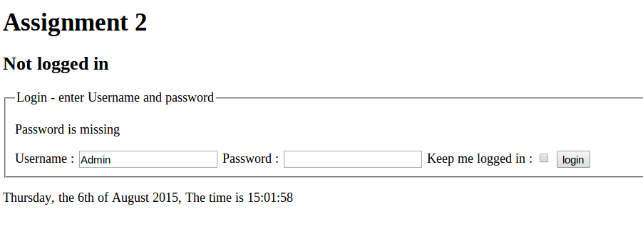

##Mandatory Testcases

##Test case 1.1, Navigate to Page 
Normal navigation to page, page is shown.

Todays date is shown as: [Day of week], the [day of month numeric]th of [Month as text] [year 4 digits]. The time is [Hour]:[minutes]:[Seconds].
Example: "Monday, the 8th of July 2015, The time is 10:59:21".

###Input:
 * Clear existing cookies
 * Navigate to site.
 
###Output:
 * The text "Not logged in", is shown.
 * A form for login is shown
 * Todays date and time is shown in correct format.
 

***

##Test case 1.2: Failed login without any entered fields
Make sure login cannot happen without entering any fields

###Input:
 * Testcase 1.1
 * Make sure both username and password is empty
 * Press "login" button
 
###Output:
 * The text "Not logged in", is shown.
 * Feedback: “Username is missing” is shown
 * A form for login is shown

***

##Test case 1.3: Failed login with only username
Make sure login cannot happen without entering both fields

###Input:
 * Testcase 1.1
 * Enter a username "Admin" and let password be empty
 * Press "login" button
 
###Output:
 * The text "Not logged in", is shown.
 * Feedback: “Password is missing” is shown
 * A form for login is shown.
 * "Admin" is filled in as username

***

##Test case 1.4: Failed login with only password
Make sure login cannot happen without entering both fields

###Input:
 * Testcase 1.1
 * Enter a password "Password" and let UserName be empty
 * Press "login" button
 
###Output:
 * The text "Not logged in", is shown.
 * Feedback: “Username is missing” is shown
 * A form for login is shown.
 * Password is empty

***

##Test case 1.5: Failed login with wrong password but existing username
Make sure login cannot happen without correct password

###Input:
 * Testcase 1.1
 * Enter a password "password" <-(NOTE THE LITTLE 'p') and let UserName be "Admin"
 * Press "login" button
 
###Output:
 * The text "Not logged in", is shown.
 * Feedback: "Wrong name or password" is shown
 * A form for login is shown.
 * Password is empty
 * "Admin" is filled in as username

***

##Test case 1.6: Failed login with existing password but wrong username
Make sure login cannot happen without correct username even if some user has that password

###Input:
 * Testcase 1.1
 * Enter a password "Password" and let UserName be "admin" <-[Note the little 'a']
 * Press "login" button
 
###Output:
 * The text "Not logged in", is shown.
 * Feedback: "Wrong name or password" is shown
 * A form for login is shown.
 * Password is empty
 * "admin" is filled in as username

***

##Test case 1.7: Successful login with correct Username and Password
Make sure login will happen if correct username and password is used

###Input:
 * Testcase 1.1
 * Enter a password "Password" and let UserName be "Admin"
 * Press "login" button
 
###Output:
 * The text "Logged in", is shown.
 * Feedback: "Welcome" is shown
 * A button for logout is shown.
 * (No login form)

***

##Test case 1.8: Still logged in after reload
Make sure we are kept logged in after a reload of the page 

###Input:
 * Testcase 1.7
 * Reload the page without entering any information. (Select URL and press enter)
 
###Output:
 * The text "Logged in", is shown.
 * No feedback is shown
 * A button for logout is shown.

##Test case 1.8.1: Still logged in after reload with resend of information (f5)
Make sure we are kept logged in after a reload of the page 

###Input:
 * Testcase 1.7
 * Reload the page without entering any information. (Resend POST information with f5)
 
###Output:
 * The text "Logged in", is shown.
 * No feedback is shown
 * A button for logout is shown.

***

##Test case 1.9: Logged in in another Window
Make sure we are logged in all windows and tabs of the same browser

###Input:
 * Testcase 1.7
 * Open another browser window or tab and enter the same adress as in Test case 1.1
 
###Output:
 * The text "Logged in", is shown.
 * No feedback is shown
 * A button for logout is shown.

***

##Test case 2.1: Logout
Make sure we are logged out after pressing logout

###Input:
 * Testcase 1.7
 * Press "logout" button
 
###Output:
 * The text "Not logged in", is shown.
 * The feedback "Bye bye!" is shown
 * An empty form for login is shown.

***

##Test case 2.2: Logout by closing the browser
Make sure we are logged out after closing the browser

###Input:
 * Testcase 1.7
 * Close the browser (every tab)
 * Restart the browser
 * Navigate to the URL
 
###Output:
 * See testcase 1.1

***

##Test case 2.3: Logged out in every window
Make sure that we are REALLY logged out...

###Input:
 * Testcase 1.9
 * press logout in one window/tab
 * go to the other window/tab and reload (by selecting URL and press enter)
 
###Output:
 * First tab: "Bye bye!"
 * second tab: "No feedback"
 * Both tabs: login form is shown
 * Both tabs: "Not logged in"

###Tab 1

###Tab 2

***

##Test case 2.4: Logout cannot happen if not logged in
Make sure we are logged out after closing the browser

###Input:
 * Testcase 1.7 
 * Press logout
 * Resend the POST information by reloading with F5

###Output:
 * See testcase 1.1
 * No message is shown

